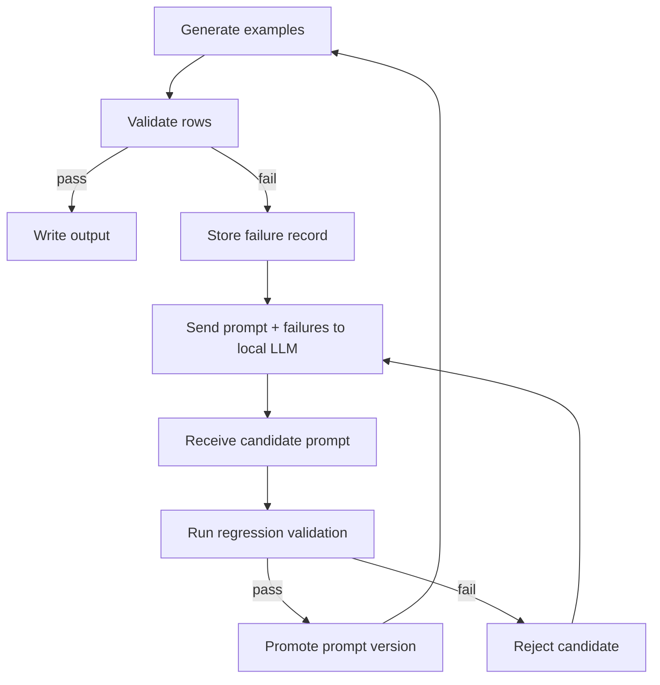

# Local Prompt Self-Improvement Plan

## Goal

Store generation prompts in a local file-based store, then use validation failures and rejected examples as feedback to improve those prompts automatically.

The loop should be:

1. Generate examples with the current prompts.
2. Validate the output.
3. Capture failures, error categories, and minimal context.
4. Ask a local LLM to propose a prompt improvement that specifically addresses the failure.
5. Review and apply the improvement.
6. Re-run generation and validation to confirm the fix.

## Feasibility

Yes, this is feasible.

Why it is feasible:

- The prompts are already externalized in `.md` and `.json` files, so the generator is not hard-coded to prompt text.
- Validation already produces structured failure information that can be used as training signal for prompt repair.
- A local file store can store prompt versions, failure cases, and improvement proposals with traceability.
- A local LLM can be used as a prompt editor, while the actual acceptance decision stays with deterministic validation.

Main constraint:

- The system must not let the LLM overwrite prompts blindly. Every suggested change should be gated by validation and, ideally, a diff review step.

## Recommended Design

### 1. Prompt Storage Layer

Use a directory-based store on disk. The current source files remain the editable truth, and the store keeps snapshots, failures, and candidate repairs.

Suggested layout:

This repository now uses:

```text
state/prompt_store/
  snapshots/
    <timestamp>/
      prompts/
      specs/
      manifest.json
  failures/
    failures.jsonl
    by-guardrail/
  candidates/
    <timestamp>_<guardrail>_<language>.md
    <timestamp>_<guardrail>_<language>.json
  history/
    prompt_versions.jsonl
```

Suggested records inside the JSONL files:

- `prompt_id`
- `prompt_type` (`system`, `generation`, `retry`, `few_shot`, `rule_contract`)
- `language`
- `content`
- `version`
- `created_at`
- `updated_at`
- `source_file`
- `status` (`active`, `candidate`, `rejected`)

### 2. Failure Capture Layer

On every validation failure, store:

- failing example ID
- guardrail
- language
- error codes / issues
- assistant turn that failed
- tool usage metadata
- minimal surrounding context
- timestamp

This should be saved as structured data, not just logs, so the LLM can learn from repeated patterns.

### 3. Prompt Repair Agent

When enough failures accumulate, send a repair request to a local LLM with:

- the current prompt
- the failure pattern
- a small set of representative failing examples
- the specific rule that failed
- the constraint that the output must remain compatible with existing style and schema

The LLM should return:

- a proposed revised prompt
- a short explanation of the change
- optionally a diff-like summary

### 4. Guarded Update Flow

Do not auto-apply changes directly to the active prompt.

Instead:

1. Save the suggested prompt as a candidate version.
2. Run validation against a small regression set.
3. If the candidate improves the failures and does not introduce regressions, mark it as promotable.
4. Apply it only after that check.

### 5. Regression Protection

Every prompt change should be checked against:

- existing passing validation tests
- known hard examples from the current failure set
- a small canary generation run

This prevents the prompt from fixing one issue while breaking another.

## Suggested Workflow



## Risks

- The LLM may overfit to one failure and weaken the prompt more broadly.
- A prompt fix might hide the symptom instead of addressing the actual root cause.
- If prompt edits are auto-applied too aggressively, the system can drift over time.
- File-based prompt management still needs careful versioning and regression gates to avoid drift.

## Mitigations

- Keep deterministic validation as the final authority.
- Require a diff-based review step before promotion.
- Preserve prompt version history for rollback.
- Restrict the LLM to prompt text only, not schema or validator code.
- Maintain a regression test set that includes older hard failures.

## Minimal First Build

If we build it, the first useful version should only do this:

1. Store prompt versions.
2. Store validation failures.
3. Ask the local LLM for a revised prompt suggestion.
4. Save the suggestion as a candidate.
5. Manually or semi-automatically promote the candidate after tests pass.

That keeps the initial scope small and avoids overengineering.

## Implementation Status

Implemented so far:

- `src/prompt_store.mjs` writes prompt snapshots, failure records, and candidate files to `state/prompt_store/`.
- `run_generation_campaign.mjs` snapshots the active prompt/spec bundle at campaign start.
- `validate.mjs` records each failed example as structured file-based feedback.
- `repair_prompts.mjs` reads recent failures, asks the local LLM for a revised prompt, stores a candidate, and can promote it after tests pass.
- A new test file covers the store snapshot, failure recording, and candidate creation behavior.

Still optional if you want a stricter workflow:

- a human review step before promotion
- richer diff summarization in the repair output
- automated candidate scoring before applying a promotion

## Decision Point

If you want to build this further, the next step should be a narrow implementation plan for:

- failure capture format
- prompt repair workflow
- candidate promotion process
- regression gating rules for promotion
